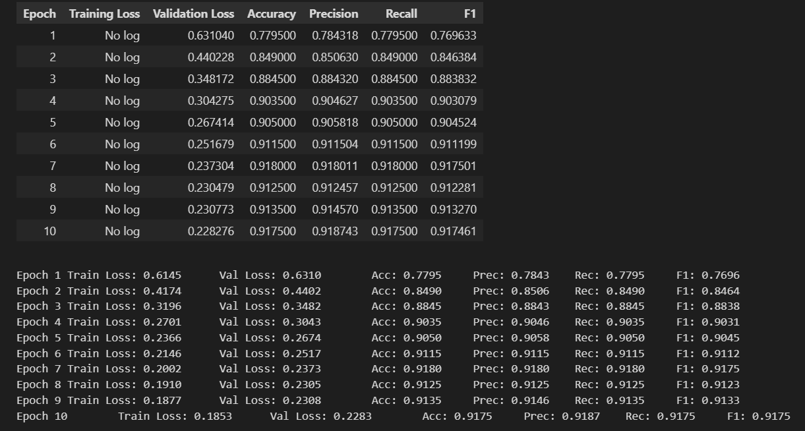
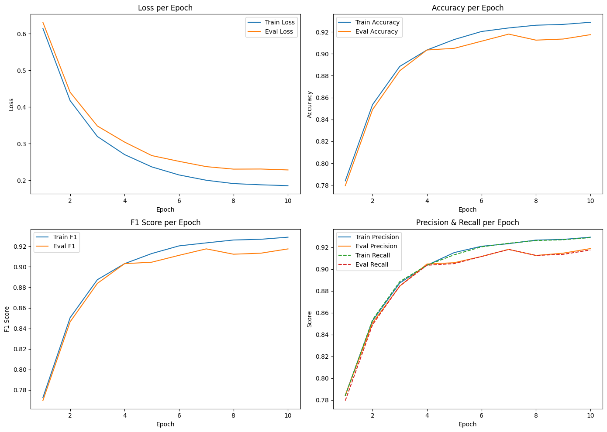
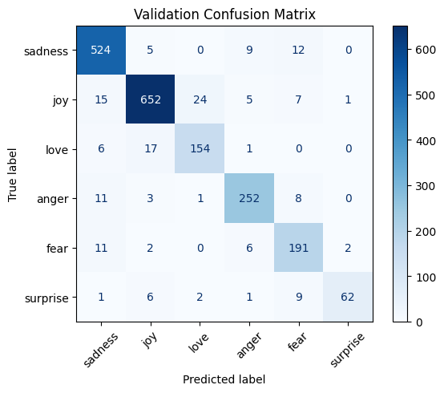
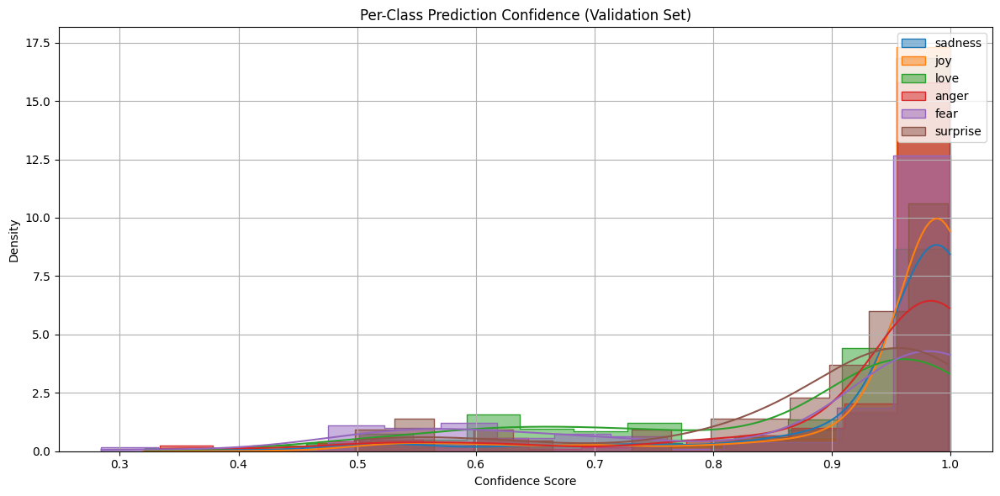
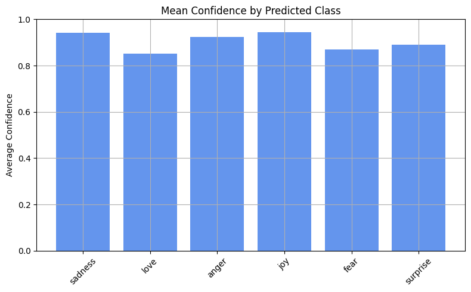
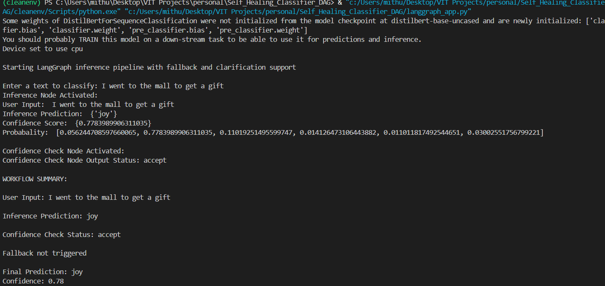
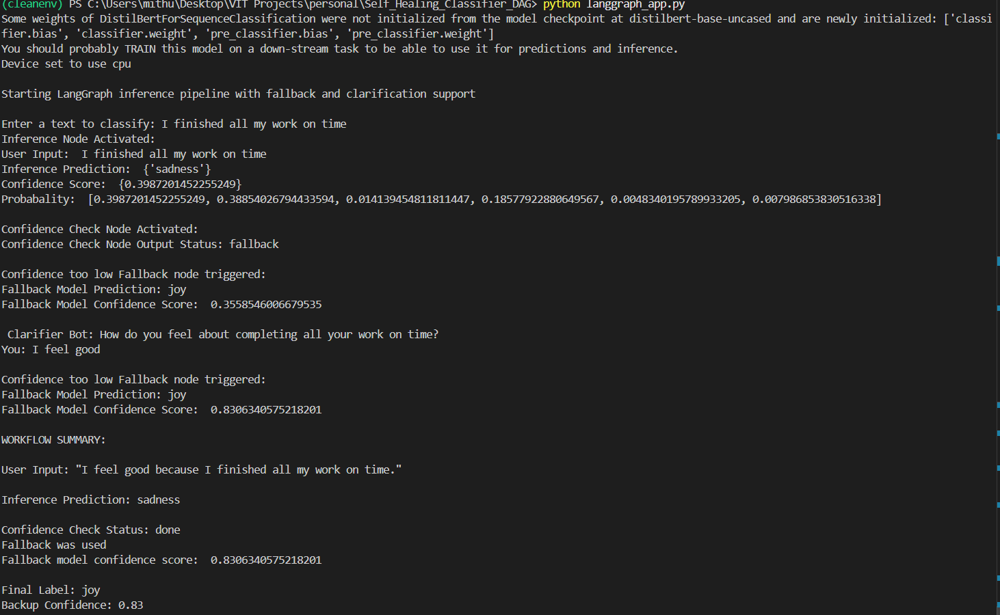
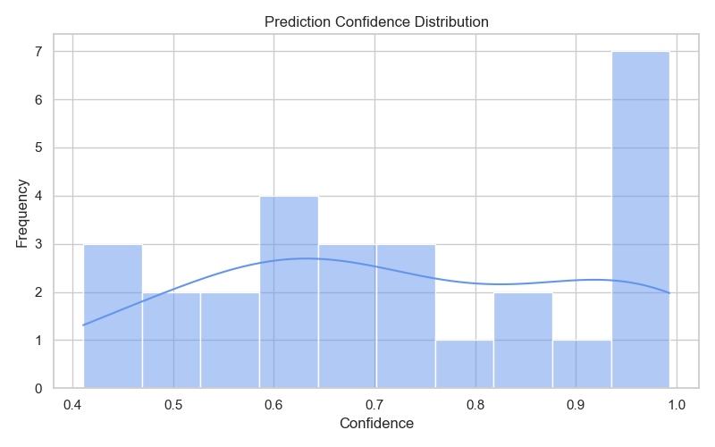
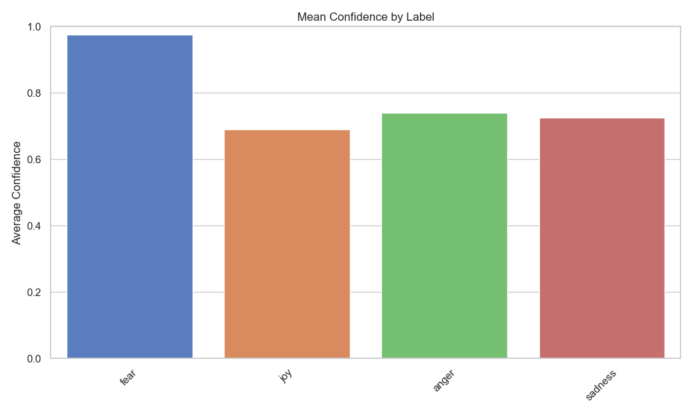
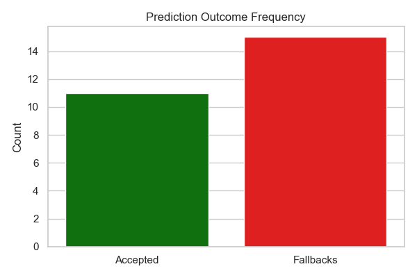

# Self Healing Classifier using DAG

## How To Setup?
### Step1: 
- Clone the repository git clone https://github.com/Mithunraj-M/Self_Healing_Classifier_DAG.git

### Step2: 
- pip install -r requirements.txt

### Step3:
- In CLI run python script: python langgraph_app.py
## Implementation
## Fine tuned Transformer Model
- fine tuned DistillBERT using LoRA 
- Dataset used: dair-ai/emotion

### Performance Metrics

### Final Train Metrics:
- train_loss: 0.1853
- train_accuracy: 0.9288
- train_precision: 0.9292
- train_recall: 0.9288
- train_f1: 0.9289

### Final Validation Metrics:
- eval_loss: 0.2283
- eval_accuracy: 0.9175
- eval_precision: 0.9187
- eval_recall: 0.9175
- eval_f1: 0.9175

### confusion matrix

### Per class confidence score

### Mean Confidence Score

## Inference Node

- Uses the saved transformer model to predict the emotion label
- Input: String 
       Ex:"i can go from feeling so hopeless to so damned hopeful just from being around someone who cares and is awake"
- Outputs the emotion prediciton and its confidence score

## Confidence Check Node

- Uses the Confidence Score computed by the inference node to check if the confidence score is above threshold
- If confidence Score is above threshold status is set to 'accept'
- else status is set to "fallback"moving to the Fallback node

## FallBack Node

- Uses zero-shot classifier model : facebook/bart-large-mnli
- outputs emotion prediction and confidence score
- The confidence score is again checked against threshold and in case it is not accepted , it calls the clarification node

## Clarification Node

- Uses LLM Chains for asking clarification questions and augments to input text
- Augmented clarification text is passed on back to the fallback node for final prediction

## Visualizer 

- provides plots of 'Prediction Confidence Distribution' , 'Mean Confidence by Label' , 'Prediction Outcome Frequency'
- visualizer makes use of the data monitored and logged in the logs.

## Logs

- Logs at each node is monitored and logged into the logs folder present in the repository

# Working Examples
## Example1: 

## Example2:

  